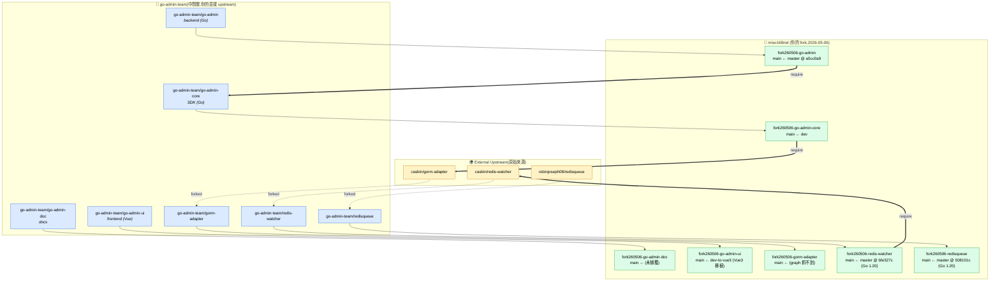

# 七個 fork260506-* repo 關聯圖

紀錄 7 個 repo 之間的關係 —— Fork 血統、程式碼相依、專案類型分工。資料來源:每個 repo 的 `graphify-out/graph.json`(`graphify query` 查 x_fork.* 節點)+ 各 repo 的 `go.mod` / `package.json`。

最後驗證日期:2026-05-06

---

## 圖 1:Fork 血統 + 程式碼相依



### 三個層級

| 層級 | 角色 | 你能改嗎 |
|---|---|---|
| **External**(casbin / robinjoseph08) | 原始作者 | ❌(送 PR 才能改) |
| **go-admin-team** | 中間 fork(go-admin 團隊把外部 lib 收進自家 org) | ❌ |
| **miso168net** | 你個人的 fork | ✅(2026-05-06 commit + push 完成) |

---

## 圖 2:7 repo 內部分工(專案類型 + 連線方式)

```
fork260506-go-admin              ← 主應用(Go backend, gin + casbin RBAC)
    │
    ├── 編譯期 import (go.mod require)
    │
    ├── fork260506-go-admin-core  ← SDK / 共用模組(Go,被 go-admin import)
    │       │
    │       └── 編譯期 import → casbin/gorm-adapter
    │           (注意:fork260506-go-admin-core 的 go.mod 直接抓 casbin 原版,
    │            不是 go-admin-team/gorm-adapter,也不是 fork260506-gorm-adapter)
    │
    ├── 運行期 HTTP API(沒有編譯期相依)
    │
    ├── fork260506-go-admin-ui    ← 前端(Vue,npm 專案,只走 HTTP)
    │
    └── fork260506-go-admin-doc   ← 文件(npm 專案,推測 Vuepress/Docsify)

獨立 Go module(可被任何 Go 專案間接使用):
    fork260506-gorm-adapter       module: github.com/go-admin-team/gorm-adapter/v3
    fork260506-redis-watcher      module: github.com/go-admin-team/redis-watcher/v2
    fork260506-redisqueue         module: github.com/go-admin-team/redisqueue/v2
```

---

## 7 repo 完整對照表

| Fork | 專案類型 | 上游(外部) | 上游(go-admin-team) | main 來源分支 | Source HEAD | 升級主題 |
|---|---|---|---|---|---|---|
| go-admin | Go backend | — | go-admin-team/go-admin | master | `a5cc0a9` | Add HTTP timeout |
| go-admin-core | Go SDK | — | go-admin-team/go-admin-core | **dev**(master 停 3y5m) | (graph 未捕獲) | — |
| go-admin-doc | docs (npm) | — | go-admin-team/go-admin-doc | (未捕獲) | (未捕獲) | — |
| go-admin-ui | Vue frontend (npm) | — | go-admin-team/go-admin-ui | **dev-to-vue3** | (未捕獲 commit) | Vue 2 → Vue 3 |
| gorm-adapter | Go lib | **casbin/gorm-adapter** | go-admin-team/gorm-adapter | (graph 抓太淺,只 1 node) | — | — |
| redis-watcher | Go lib | **casbin/redis-watcher** | go-admin-team/redis-watcher | master | `bfe327c` | Go 1.20 upgrade |
| redisqueue | Go lib | **robinjoseph08/redisqueue** | go-admin-team/redisqueue | master | `508101c` | Go 1.20 upgrade |

---

## 共同行為:2026-05-06 的協調式 master → main 轉換

7 個 fork **同一天**做了 default branch rename(master → main):
- go-admin / redis-watcher / redisqueue / gorm-adapter:從 `master` 分出 `main`
- go-admin-core:從 `dev` 分出 `main`(原因:upstream master 停滯 3y5m)
- go-admin-ui:從 `dev-to-vue3` 分出 `main`(原因:配合 Vue 3 移植)
- go-admin-doc:來源未在 graph 中捕獲

兩個 Go 1.20 升級 commit(`bfe327c`、`508101c`)出現在 redis-watcher / redisqueue,顯示這次 fork 同時做了 Go 版本對齊。

---

## 三個關鍵發現

### 1. 重命名脫節:Go module path 沒改

你的 `fork260506-gorm-adapter` 在 GitHub 路徑是 `miso168net/fork260506-gorm-adapter`,但 `go.mod` 的 `module` 行寫的是 **`github.com/go-admin-team/gorm-adapter/v3`**(原版路徑,沒改)。

**意思**:任何想用你 fork 的下游專案,必須在它自己的 `go.mod` 加 replace directive:

```go
replace github.com/go-admin-team/gorm-adapter/v3 => github.com/miso168net/fork260506-gorm-adapter latest
```

否則 `go get` 會抓 go-admin-team 原版,不會抓到你的 fork。redis-watcher、redisqueue 同理。

### 2. 已預埋的本地開發模式(local dev replace)

`fork260506-go-admin/go.mod` 裡有兩條**註解掉的** `replace` directives:

```go
//	github.com/go-admin-team/go-admin-core v1.5.2-... => ../go-admin-core/
//	github.com/go-admin-team/go-admin-core/sdk v1.5.2-... => ../go-admin-core/sdk
```

說明你事前就規劃好把 7 個 repo 並排放在同一個 workspace 目錄(`fork-go-admin/` 下),跨 repo 一起改時把這兩行 uncomment 即可走 local dev,不用每次 push 才能測試。

### 3. 兩個 repo 不是 Go 專案,跟 backend 沒有編譯期相依

`go-admin-doc` 跟 `go-admin-ui` **沒有 go.mod**,只有 `package.json`(`go-admin-ui/package.json` 的 `name` 欄甚至寫的是 `"go-admin"`,引用 go-admin-team 的 GitHub URL)。

跟 5 個 Go 專案的關係只有**運行時的 HTTP API**:
- `go-admin`(backend)提供 REST API
- `go-admin-ui`(frontend)呼叫 API
- `go-admin-doc`(docs)描述 API

**沒有 import / require 的編譯期依賴**。改 backend code 不會直接影響 ui/doc 的編譯,只會影響運行時行為。

---

## 如何跑起來(Run It)

7 個 repo 中 **3 個 runnable + 4 個純 library**:

| Repo | 角色 | 跑法 |
|---|---|---|
| **fork260506-go-admin** | Backend(Go,gin + casbin RBAC)| `./go-admin server -c config/settings.sqlite.yml` |
| **fork260506-go-admin-ui** | Frontend(Vue CLI)| `npm install && npm run dev`(port 8080) |
| **fork260506-go-admin-doc** | Docs(Dumi)| `npm install && npm run dev` |
| fork260506-go-admin-core | Library | 被 go-admin import,不獨立跑 |
| fork260506-gorm-adapter | Library | 同上 |
| fork260506-redis-watcher | Library | 同上 |
| fork260506-redisqueue | Library | 同上 |

### 路徑 A — 最簡:SQLite 本機直跑(0 個 docker container)

`config/settings.sqlite.yml` 沒有 redis section,**完全不需要外部基礎設施**(DB 用 SQLite 檔、無 Redis)。最佳的快速試跑方案。

```bash
# Terminal 1: backend (port 8000)
cd fork260506-go-admin
go build -tags sqlite3 -o go-admin .            # 或 make build-sqlite
./go-admin server -c config/settings.sqlite.yml

# Terminal 2: frontend (port 8080,Vue CLI 預設)
cd fork260506-go-admin-ui
npm install
npm run dev
# 開瀏覽器 http://localhost:8080
```

**前置條件**:
- Go 1.20+
- Node 16+
- WSL 上要裝 `gcc`(`-tags sqlite3` 會走 CGO)—— `sudo apt install build-essential libsqlite3-dev`

**首次啟動**會自動:
- 建 SQLite 資料庫檔 `go-admin-db.db`(在 fork260506-go-admin/ 根目錄)
- 跑 migration 建表

### 路徑 B — Docker Compose(現有 compose 不完整)

`fork260506-go-admin/docker-compose.yml` 現狀**只定義 `go-admin-api` 一個 service**,沒有 db / redis。要走 docker 模式得自己補。

只想 SQLite + docker:
```bash
cd fork260506-go-admin
cp config/settings.sqlite.yml config/settings.yml   # 或手動把 driver 改 sqlite3
make build                                          # build image
docker-compose up -d
```

要 MySQL + Redis + docker:得在 `docker-compose.yml` 加上 mysql、redis service,並補對應 volumes / env / network。

### 路徑 C — 完整生產:MySQL + Redis

```bash
# 起基礎設施
docker run -d --name mysql -e MYSQL_ROOT_PASSWORD=root -p 3306:3306 mysql:8
docker run -d --name redis -p 6379:6379 redis:7-alpine

# Backend(用 settings.full.yml,先填 db / redis 連線資訊)
cd fork260506-go-admin
go build -o go-admin .
./go-admin migrate -c config/settings.full.yml      # 建表
./go-admin server  -c config/settings.full.yml

# Frontend(production build → 部署到 nginx)
cd ../fork260506-go-admin-ui
npm install && npm run build:prod
# dist/ 部署到 nginx 或任何 static server
```

### 四個 settings.*.yml 的差異(`fork260506-go-admin/config/`)

| 檔名 | DB driver | Redis | 用途 |
|---|---|---|---|
| `settings.sqlite.yml` | sqlite3 | 無 | 本機快速試跑(路徑 A 用) |
| `settings.full.yml` | mysql/postgres | 有 | 完整功能(路徑 C 用) |
| `settings.demo.yml` | (demo 設定) | 視內容 | demo / 範例用 |
| `settings.yml` | (專案實際使用) | 視內容 | 從前三者 copy 過來改 |

### 兩個踩雷點

1. **WSL + SQLite + CGO**:`-tags sqlite3` 編譯需要 C 編譯器。沒裝會看到 `cc: command not found`。Ubuntu/Debian:`sudo apt install build-essential libsqlite3-dev`。或改用純 Go 的 SQLite(`modernc.org/sqlite`),但要改 go-admin-core 的 db driver 註冊。
2. **docker-compose 不完整**:現有 compose 只有 `go-admin-api`,假設你已經有外部 mysql/redis。從零起整套要自己補 db + redis service 跟 networks 設定。可參考 README 是否有舊版 compose-with-deps,或自己寫一份。

### 推薦試跑順序

1. **先走路徑 A**(SQLite 本機)確認 backend + frontend 都能起
2. 確認瀏覽器能進登入頁、能登入(預設帳密看 README 或 settings.yml,通常 `admin` / `123456`)
3. 要跑跟 Redis 相關的功能(`redis-watcher` 的 casbin policy hot-reload、`redisqueue`)再走路徑 C

### 路徑 A 的端口/服務對照

```
Backend:  http://localhost:8000   (REST API)
Frontend: http://localhost:8080   (Vue CLI dev server)
Frontend → Backend:  go-admin-ui 的 .env / vue.config.js 設定 proxy 轉到 8000
資料庫檔: fork260506-go-admin/go-admin-db.db (SQLite)
```

---

## graph 覆蓋品質的 caveat

各 repo 的 `x_fork.*` 節點數差異(2026-05-06 graph build):

| Repo | x_fork.* nodes |
|---|---|
| redis-watcher | 9 |
| redisqueue | 8 |
| go-admin-ui | 7 |
| go-admin | 6 |
| go-admin-doc | 4 |
| go-admin-core | 2 |
| **gorm-adapter** | **1** ← 抓太淺,本表多項只能標「未捕獲」 |

要修補(尤其 gorm-adapter 跟 go-admin-core),參考 `fork260506_update.md` §5 + §6 的兩個過濾技巧:
1. 過濾 `graphify-out/.graphify_*.json` 避免 self-pollution
2. 識別並 `rm` 對應 cache 檔強制重抽(用 `data['nodes'][0]['source_file']` 反查)

---

## 驗證命令(reproducibility)

要重現此關聯圖的資料,在每個 repo 內跑:

```bash
# Fork 血統(從 graphify graph 查 x_fork.* 節點)
graphify query "main branch fork upstream master"

# Go module 相依(從 go.mod)
grep -E "^module |go-admin|gorm-adapter|redis-watcher|redisqueue" go.mod
```

或對 7 個 repo 一次跑:

```bash
WS=/mnt/d/AnewSpaces/Local/x_Project/TEST-claude/fork-go-admin
for d in fork260506-go-admin fork260506-go-admin-core fork260506-go-admin-doc \
         fork260506-go-admin-ui fork260506-gorm-adapter \
         fork260506-redis-watcher fork260506-redisqueue; do
  echo "=== $d ==="
  ( cd "$WS/$d" && graphify query "main branch fork upstream" 2>&1 | tail -20 )
  echo "---go.mod---"
  grep -E "^module |go-admin|gorm-adapter|redis-watcher|redisqueue" "$WS/$d/go.mod" 2>/dev/null | head -5
  echo ""
done
```

---

## 後續建議

1. **修補 graph 覆蓋**:對 `gorm-adapter` / `go-admin-core` 跑 graphify update(套用 `fork260506_update.md` §5+§6 過濾技巧),把 x_fork.* 節點數補到 ≥6,讓表格中「(未捕獲)」項目能填滿。
2. **跨 repo merge graph**:graphify 0.7.7 有 `merge-graphs <g1> <g2>` 子命令,可以把 7 個 graph.json 合成一個總 graph,做更精細的 cross-repo 分析(例如:go-admin import 鏈中有哪些函式跨到 go-admin-core)。
3. **填寫 go-admin-doc 的 main 來源**:目前 graph 裡沒抓到,跟其他 6 個比資料明顯較少。可考慮人工補一下 `x_fork.branch-origin.md` 內容後重抽。
4. **若要對外發布 fork**:要把 5 個 Go fork 的 `go.mod` `module` 行改成 `github.com/miso168net/fork260506-<name>`(否則下游無法 `go get` 你的 fork),代價是會跟 go-admin-team upstream 失聯,日後 merge upstream 變麻煩。當前路徑保留是合理的「私人 fork」設計。
